# ANSAT-PRO 

Welcome to **ANSAT-PRO** – your comprehensive platform for managing nursing student assessments, feedback, and scores. This manual will guide you step-by-step on how to navigate and utilize the platform effectively.

---

## 📖 Table of Contents

- [ANSAT-PRO User Manual](#ansat-pro-user-manual)
  - [📖 Table of Contents](#-table-of-contents)
  - [🚀 Getting Started](#-getting-started)
  - [🔐 Logging In](#-logging-in)
  - [🧭 Dashboard Overview (Facilitator)](#-dashboard-overview-facilitator)
  - [🧭 Dashboard Overview (Preceptor)](#-dashboard-overview-preceptor)
  - [🎓 Managing Students (Facilitator)](#-managing-students-facilitator)
  - [✍️ Reviewing Feedback (Facilitator)](#️-reviewing-feedback-facilitator)
  - [⚙️ Settings](#️-settings)
  - [📩 Support](#-support)

---

## 🚀 Getting Started

### Using the Live Application

To use ANSAT-PRO online:

- Visit [https://ansatpro-web.vercel.app/](https://ansatpro-web.vercel.app/)
- Use your facilitator or preceptor account to log in.
- If you are new, please sign up to create an account using a valid work email.

### Running Locally from Repository

To set up and run the project locally:

1. Clone the repository:
   ```
   git clone https://github.com/ansatpro/ansatpro-web.git
   ```

2. Navigate to the project directory:
   ```
   cd ansatpro-web
   ```

3. Install dependencies:
   ```
   npm install
   ```
   
4. Start the development server:
   ```
   npm run dev
   ```
   
5. Open your browser and visit:
   ```
   http://localhost:3000
   ```

---

## 🔐 Logging In

1. Go to the **Login** page.
2. Enter your registered **email** and **password**.
   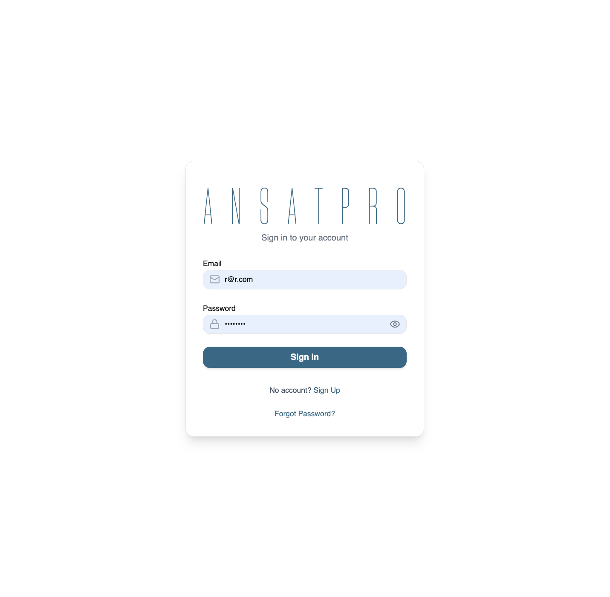
3. Click **Login** to access your dashboard.
4. Forgot your password? Click on "Forgot password" to reset it.
   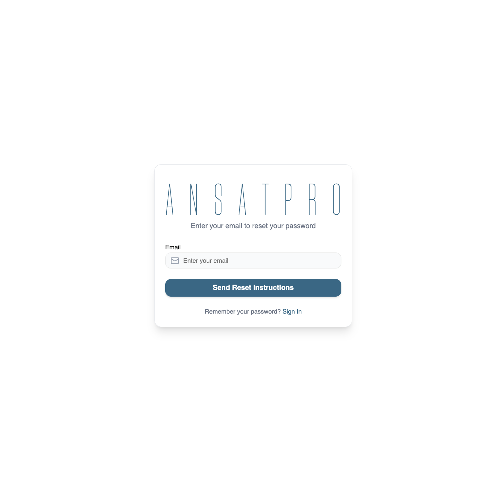

---

## 🧭 Dashboard Overview (Facilitator)

Once logged in, you'll see the main dashboard:
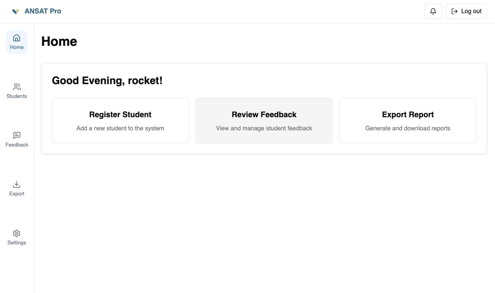

- **Register Students** – Register and view your assigned students.
  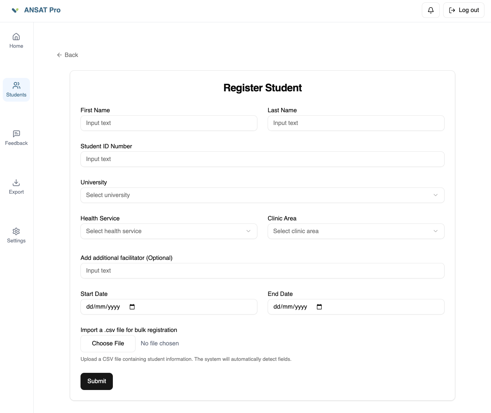
- **Review Feedback** – Access and complete pending feedback forms.
  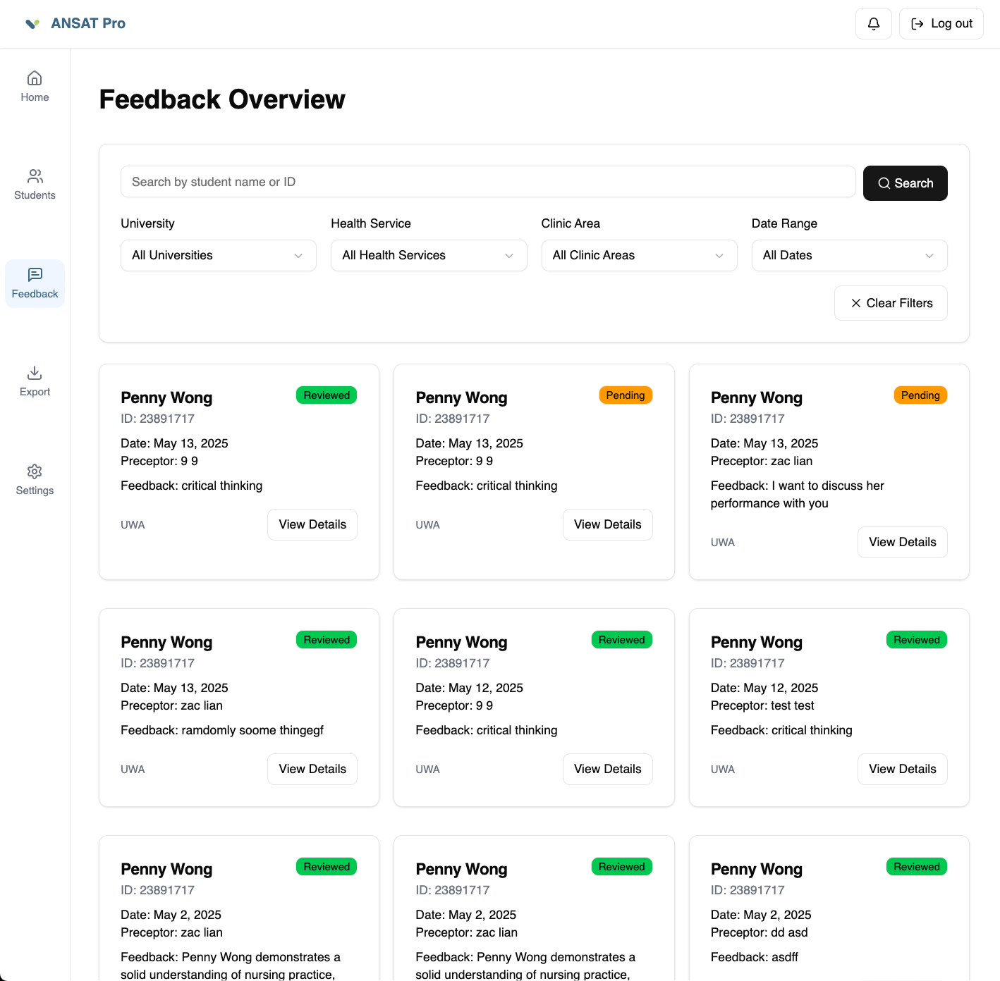
- **Export Reports** – View and export summaries of feedback and scores.
  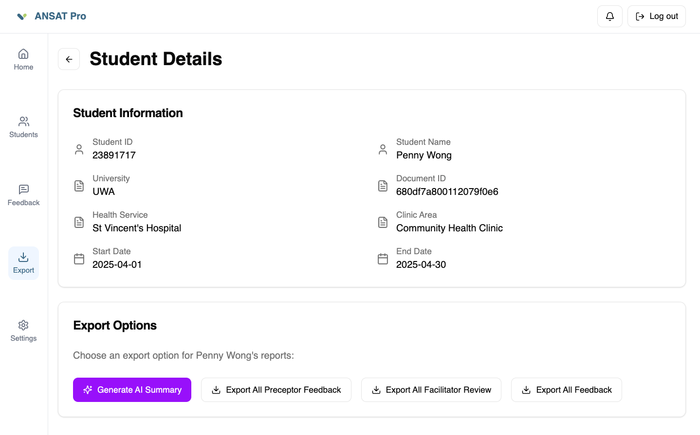
- **Notifications** – Messages and discussion requests from preceptors regarding feedback.
  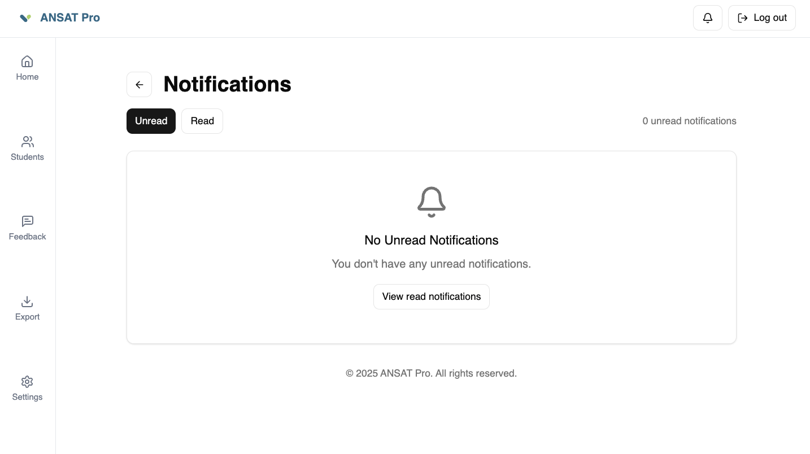

---

## 🧭 Dashboard Overview (Preceptor)

Once logged in, you'll see the main dashboard:
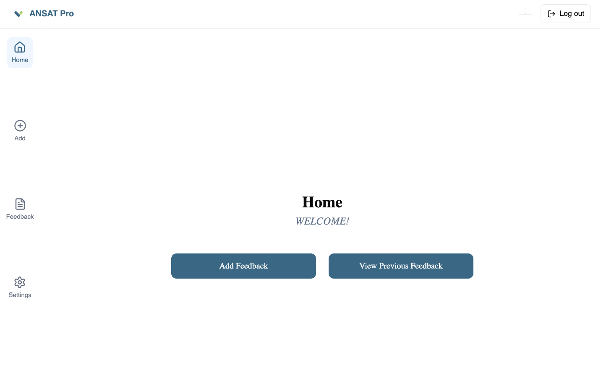

- **Add Feedback** – Submit new feedback for students.
  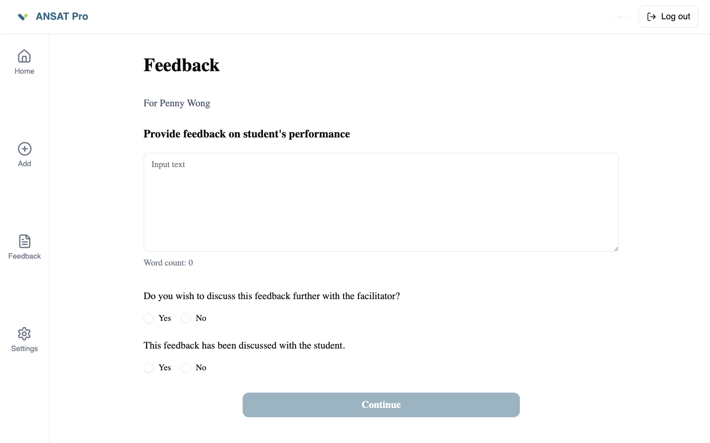
- **View Previous Feedback** – Access past feedback entries.
  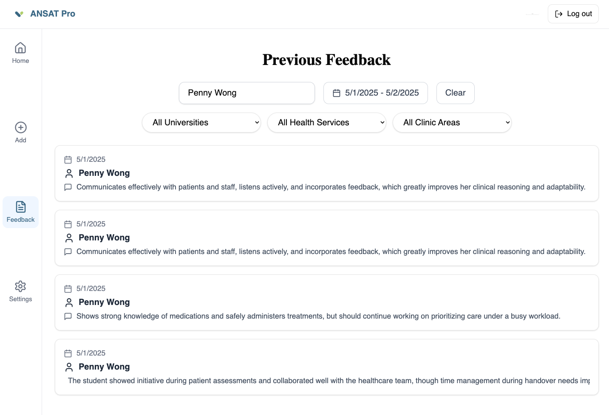

---

## 🎓 Managing Students (Facilitator)

1. Navigate to **Students** from the sidebar.
2. View detailed profiles from the student list.
   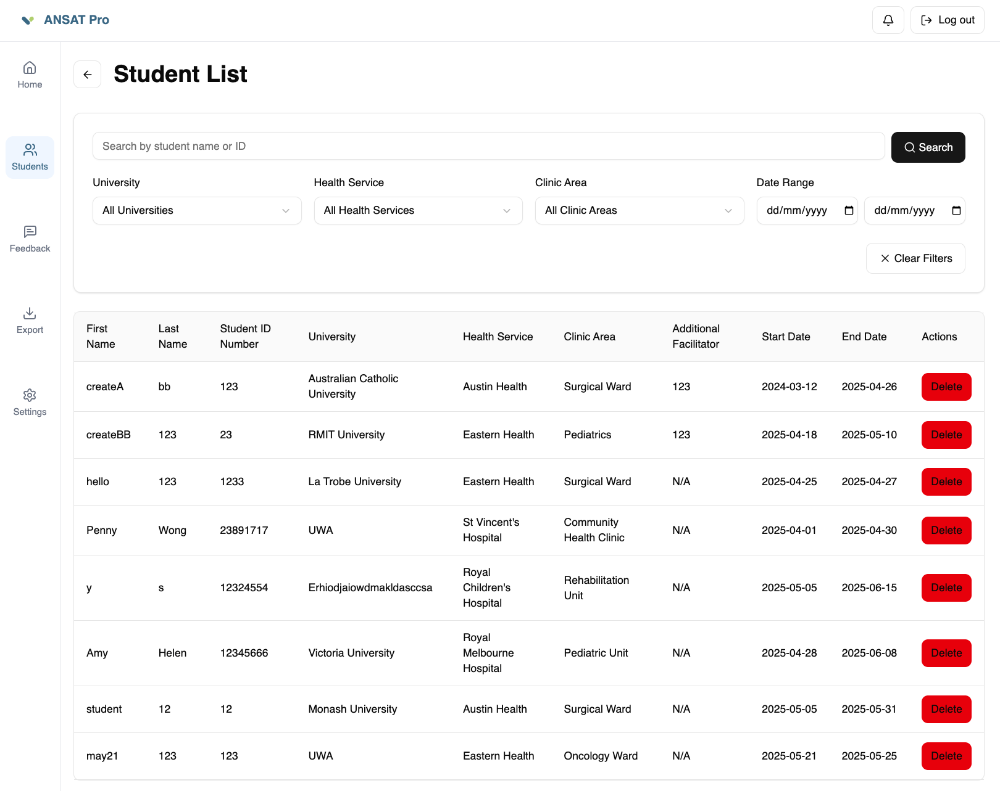
3. Register a single student or use bulk registration.
   
4. Use filters in the student list to search by name, status, or rotation.

---

## ✍️ Reviewing Feedback (Facilitator)

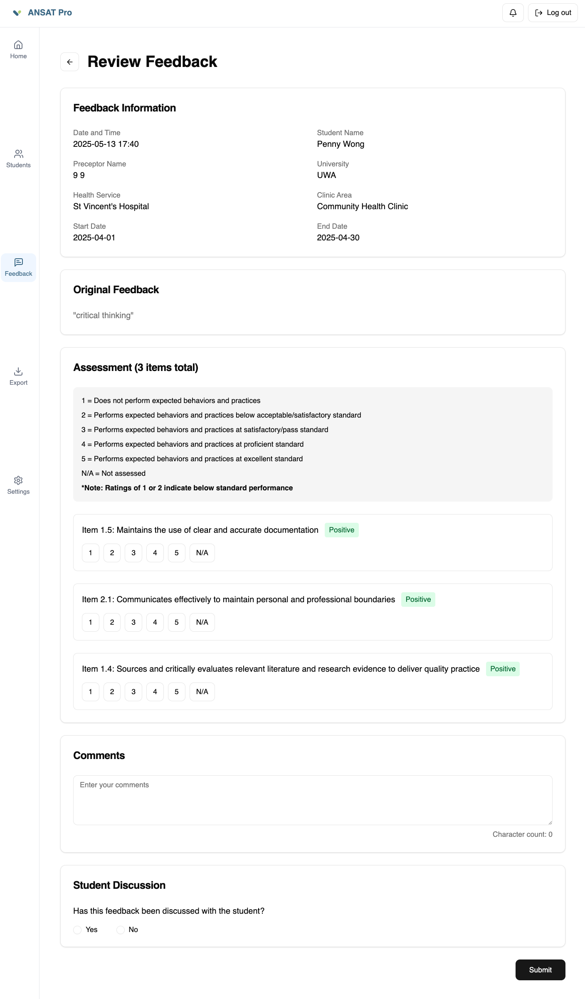

1. Go to the **Feedback** page.
2. View AI-generated feedback items and past facilitator input.
3. You can edit or add feedback manually.
4. Use the rating interface to score each ANSAT item.
5. Submit once complete — your review is saved and available for export.

---

## ⚙️ Settings

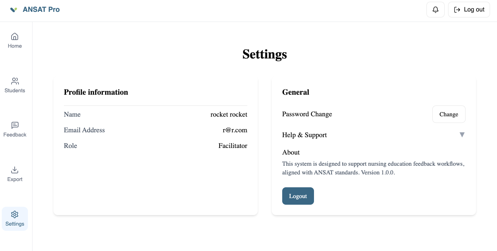

- Click Settings in the left sidebar.
- View your profile information.
- To change your password, click the Change button from the dashboard.

---

## 📩 Support

For help or technical issues:

- Support options are also available in the Settings dashboard.
- Email the team at: **support@ansatpro.com**
- Or contact your system administrator.

---

Thank you for using ANSAT-PRO – streamlining student evaluation with clarity and efficiency.